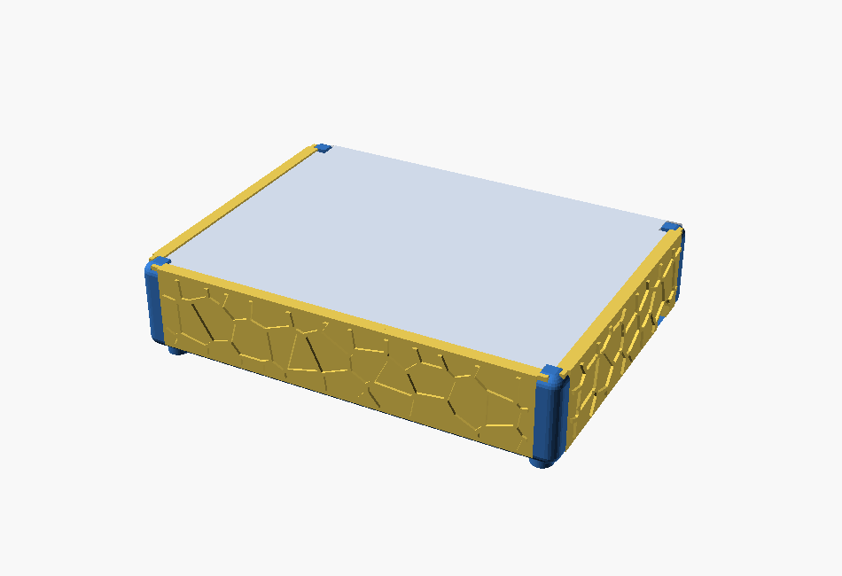

# Kabelbox – frei konfigurierbar (Voronoi, entnehmbare Wände)

**Eigenentwicklung** in OpenSCAD + Python. Eine Box mit **4 entnehmbaren
Voronoi-Wänden**, **glattem Schiebedeckel** und je Wand wählbarem **Kabelloch**.
Design-Vokabular wie der Zahnbürstenhalter (gerundet R5, 5-mm-Füße, Schiebe-Mechanik,
bündig/keine Überstände).

> **Entwickeln/Weiterarbeiten:** Stand, Parameter, Build-Ablauf und Stolpersteine
> stehen in **[`DEVNOTES.md`](DEVNOTES.md)**.

<p align="center"></p>

## Über dieses Projekt

**Warum gibt es die Kabelbox?**
Steckdosenleisten, Netzteile und Kabelsalat verschwinden am besten in einer Box – aber
die meisten fertigen Boxen sind in genau einer Größe gegossen und innen schlecht
zugänglich. Diese Box ist deshalb von Grund auf **frei konfigurierbar**: Breite, Tiefe
und Höhe sowie die Kabeldurchführungen werden in einer einzigen Parameterdatei
(`params.scad`) festgelegt, der gesamte Korpus skaliert automatisch mit.

**Idee dahinter.**
Die Box folgt einem bewussten Design-Vokabular (geteilt mit dem Schwester-Projekt
[„Elektrischer Zahnbürstenhalter"](https://github.com/workFLOw42/3D_OralB_Sonicare_toothbrush_holder)):
rundum **gerundete Kanten (R5)**, **bündige
Außenflächen ohne Überstände**, ein **erhabenes Voronoi-Relief** als Optik *und*
Materialersparnis sowie eine **werkzeuglose Schiebe-Mechanik**. Die vier Wände sind
einzeln **entnehmbar** und der Deckel gleitet von hinten ein – so kommt man jederzeit an
den Inhalt, ohne etwas aufzubrechen.

**Reproduzierbar statt Einmal-Export.**
Es handelt sich um eine **Eigenentwicklung**; alle Teile entstehen reproduzierbar aus
OpenSCAD-Quellen + Python-Generatoren (Voronoi, 3MF-Packen). Wer andere Maße braucht,
ändert die Parameter und baut neu – oder nutzt die MakerWorld-Einzeldatei mit Customizer.

**Status.** **Version 1.0** – funktionsfähig und gedruckt-verifiziert. Das jetzige
Aussehen ist der Startpunkt; das Projekt wird **bei Bedarf aktiv weiterentwickelt,
überarbeitet und erweitert**. Rückmeldungen, Ideen und Probedruck-Erfahrungen sind
willkommen.

## Konzept
- **Rahmen** (`box.scad`, bleibt fest): gerundeter Boden + **4 Eckpfosten** (flush
  in den Ecken) + **4 Füße**. Jeder Pfosten hat **2 senkrechte Nuten** für die
  angrenzenden Wände. Die Nuten liegen **bündig in den Pfosten** (Front-Skin) →
  nichts steht über; die Box-Außenkontur bleibt exakt B×T.
- **4 Wände** (`wall.scad`): **solide** Wand mit **erhabenem Voronoi-Relief** (wie
  Zahnbürstenhalter), gleiten senkrecht in die Pfosten-Nuten → **entnehmbar**.
  Außenfläche bündig (Relief steht – wie beim Holder – `relief_h` nach außen über).
  Je Wand optional ein **nach unten offener Kabel-Schlitz** (keins/links/mitte/rechts).
- **Deckel** (`lid.scad`): **glatte** Platte. Front/Links/Rechts tragen oben eine
  nach innen überstehende **Lippe** → der Deckel ist **3-seitig gefangen** und gleitet
  **von hinten** darunter ein. Die **Rückwand ist niedriger** (um `lid_t+lid_lip_t+
  lid_clear`) → der Deckel **läuft über die Rückwand** und schließt hinten **bündig**
  (y=box_d) ab. Oberseite leicht versenkt (unter den Lippen). Eck-Aussparungen für
  die Pfosten. *Entnahme: Deckel nach hinten herausschieben.*
- **Montage**: Wände von oben in die Pfosten-Nuten → Deckel von hinten unter die
  3 Lippen einschieben. Demontage umgekehrt.

## Maße (editierbar)
| | Wert |
|---|---|
| Box außen | **`box_w` × `box_d` × `box_h` = 200 × 150 × 41,8 mm** (+5 mm Füße) · **35 mm lichte Nutzhöhe** (Boden bis Deckel) |
| Wandstärke / Boden | 3 / 3 mm · Eckpfosten 10 mm · Kanten R5 |
| Kabel-Schlitz | `cable_w`=12 mm breit, unten offen, Oberkante `cable_h`=12 mm |

Position je Wand: **mitte** = exakt mittig; **links/rechts** = ein Lochbreiten-
Abstand zum inneren Rand.

## MakerWorld (Customizer)
Einzeldatei **`kabelbox_makerworld.scad`** hochladen (alle Module inline).
- **Maße**: `box_w` / `box_d` / `box_h`.
- **Kabelloch je Wand**: `cable_front/back/left/right` ∈ none/left/center/right.
- **Teil-Auswahl** `part`: `montage` (Vorschau) · `platte` (alle Teile nebeneinander)
  · `box` · `lid` · `wall_front/back/left/right`.

> **X2D-Hinweis**: Korpus und Deckel sind bei 200 × 150 jeweils fast plattengroß –
> sie passen **nicht gemeinsam** auf eine 256 × 256-Platte. Dann Teile einzeln
> wählen (2 Platten) **oder** die Box kleiner konfigurieren. `part="platte"` ist
> für kleinere Boxen gedacht.

## Bauen (lokal)
```
# Toolchain: OpenSCAD + Python (numpy, scipy, trimesh)
powershell -File build.ps1   # Voronoi -> STL -> 3MF -> Vorschau
```
Quelle: `params.scad` (Wahrheitsquelle) · `voronoi.scad` · `voronoi_data.scad` (auto)
· `box.scad` · `wall.scad` · `lid.scad` · `assembly.scad`. Werkzeuge: `gen_voronoi.py`,
`pack_3mf.py`, `build.ps1`.

## Drucken
- **Korpus**: offen nach oben, Füße unten – ohne Stützen.
- **Wände/Deckel**: flach liegend – ohne Stützen.
- **Spiele** nach Probedruck justieren: `rail_clear` (Wand↔Nut), `lid_clear` (Deckel).

## Lizenz

[CC BY-NC 4.0](LICENSE) – Namensnennung, keine kommerzielle Nutzung.
